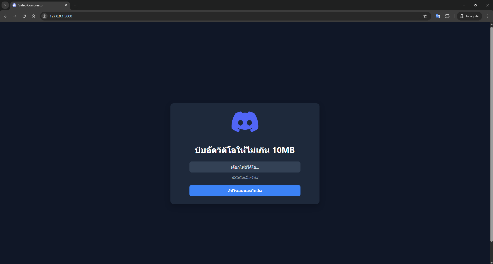

# Video Compressor Web App

> A free, open-source tool to compress your videos under 10MB in seconds. The perfect solution for bypassing file size limits on platforms like Discord.



## 🎯 The Problem (ที่มาและความสำคัญ)

Ever tried to share a cool game clip or a video meme on Discord, only to be blocked by the file size limit? This tool is built to solve that exact problem. Instead of paying for premium services like Discord Nitro just to send larger files, you can use this app to shrink your video to under 10MB in seconds, for free.

## ✨ Key Features (ฟีเจอร์หลัก)

-   **Easy Web Interface:** Simple file selection right in your browser with a modern, dark-themed UI.
-   **Efficient Compression:** Uses FFmpeg on the backend to intelligently reduce file size.
-   **Instant Feedback:** Displays the selected filename and a loading indicator during processing.
-   **Download & Cleanup:** Redirects to a success page with a download link and a feature to clean up all processed files from the server.
-   **Secure & Transparent:** As an open-source tool, you can be confident that your files are handled securely.

## 🛠️ Tech Stack (เทคโนโลยีที่ใช้)

-   **Backend:** Python, Flask
-   **Frontend:** HTML, CSS, JavaScript
-   **Core Engine:** FFmpeg

## 🚀 Getting Started (วิธีการติดตั้งและใช้งาน)

To run this project locally, you will need Python and FFmpeg installed and accessible in your system's PATH.

1.  **Clone the repository:**
    ```bash
    git clone [https://github.com/Piyabordee/discord-resize-py.git](https://github.com/Piyabordee/discord-resize-py.git)
    ```
2.  **Navigate to the project directory:**
    ```bash
    cd discord-resize-py
    ```
3.  **Install the required Python packages:**
    ```bash
    pip install Flask
    ```
4.  **Run the application:**
    ```bash
    python webapp.py
    ```
5.  Open your browser and go to `http://127.0.0.1:5000`

## 🤖 Development Process (ขั้นตอนการพัฒนา)

This project was developed with the assistance of an AI programming partner (Google's Gemini) for code generation, debugging, and explaining concepts.

However, the core architecture, technology stack selections, and all key feature decisions were directed and implemented by the project owner. The AI served as a development tool, while the project's vision and direction were human-led.

## 📄 License (ใบอนุญาต)

This project is licensed under the **MIT License**. See the `LICENSE` file for details.
